# PES-VCS Lab Report
*Name:* Shruti Sridhar  
*SRN:* PES2UG24CS498  

---

## Phase 1: Object Storage

### Screenshot 1A — test_objects output
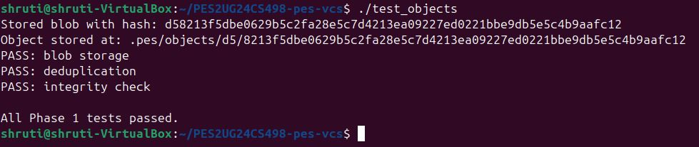

### Screenshot 1B — Object store directory structure
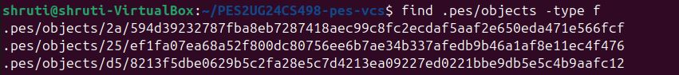

---

## Phase 2: Tree Objects

### Screenshot 2A — test_tree output
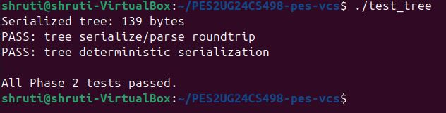
### Screenshot 2B — Raw binary tree object (xxd)
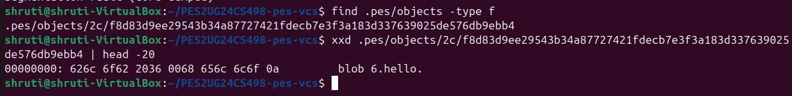

---

## Phase 3: Index / Staging Area

### Screenshot 3A — pes init, pes add, pes status
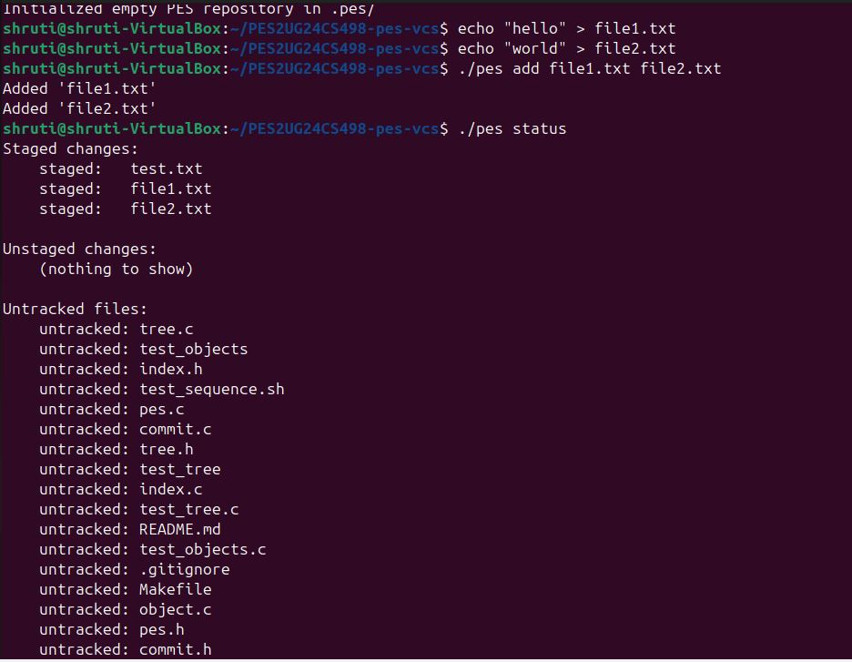

### Screenshot 3B — cat .pes/index
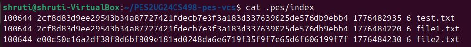

---

## Phase 4: Commits and History
### Screenshot 4A — pes log with three commits
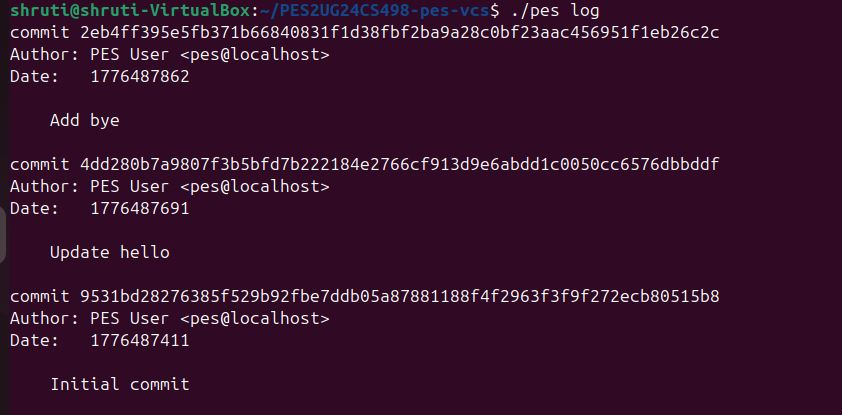

### Screenshot 4B — find .pes -type f showing object growth
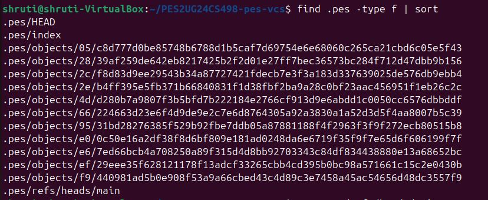

### Screenshot 4C — HEAD and branch reference chain
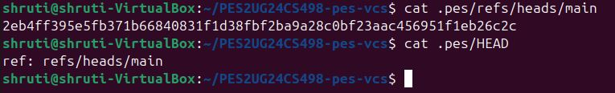

### Final — Full integration test
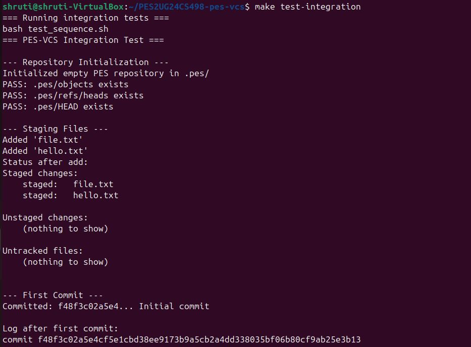
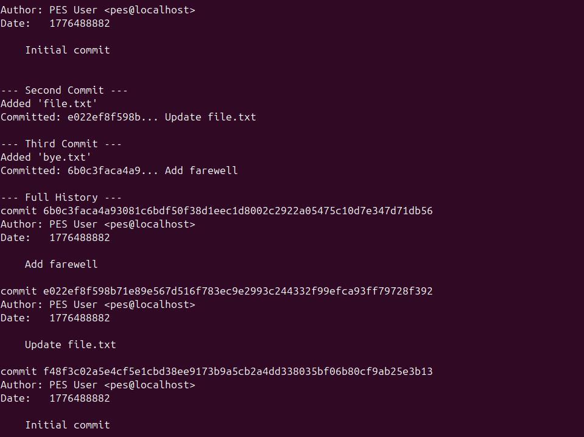
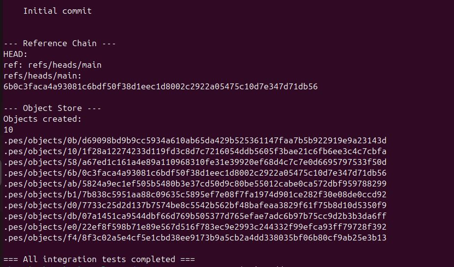

---
## Phase 5: Branching and Checkout (Analysis)

### Q5.1 — How would you implement pes checkout?
To implement pes checkout <branch>, the following must happen:

First, read the target branch file at .pes/refs/heads/<branch> to get the commit hash. Then read that commit object to get its tree hash. Compare the target tree against the current HEAD tree to find which files differ. For each differing file, extract the blob from the object store and overwrite the working directory file. Finally, update .pes/HEAD to point to the new branch: ref: refs/heads/<branch>.

This operation is complex because: if the user has modified files in the working directory that also differ between branches, we must detect and refuse the checkout to avoid losing their work. We also need to handle files that exist in one branch but not the other — adding new files and deleting removed ones.
### Q5.2 — How to detect dirty working directory conflicts?
To detect conflicts before switching branches: for each file in the current index, compare its stored mtime and size against the actual file on disk. If they differ, the file has been modified since it was last staged — this is an unstaged change. If the target branch's tree has a different blob hash for that same file, a conflict exists and checkout must be refused with an error message. This uses only the index and object store — no extra data structures needed.

### Q5.3 — What happens in detached HEAD state?
When HEAD contains a commit hash directly instead of a branch reference, any new commits are made on top of that commit but no branch pointer is updated to track them. If you switch branches, those commits become unreachable — not pointed to by any branch. To recover them, you need the commit hash (visible in the terminal output when you made the commit). You can create a new branch pointing to that hash: pes branch recovery-branch after checking out that hash, which re-attaches a branch pointer to those commits before they get garbage collected.

---

## Phase 6: Garbage Collection (Analysis)

### Q6.1 — Algorithm to find and delete unreachable objects
Start from all branch refs in .pes/refs/heads/. For each branch, read the commit object and add its hash to a reachable set. Then follow the commit's tree hash — recursively traverse all tree objects and add every blob and subtree hash to the reachable set. Follow each commit's parent pointer and repeat until there is no parent. After processing all branches, scan every file under .pes/objects/ and delete any whose hash is not in the reachable set.
The best data structure is a hash set (like a C hash table or a sorted array with binary search) for O(1) or O(log n) lookup per object.

For a repository with 100,000 commits and 50 branches: assuming each commit references ~20 unique objects on average, you would visit roughly 100,000 × 20 = 2,000,000 objects in the worst case. In practice many objects are shared across commits so the reachable set would be much smaller.

### Q6.2 — Race condition between GC and concurrent commit
The race condition works like this: GC scans all refs and builds the reachable set — at this moment, a new commit is being created but has not yet called head_update(). GC sees the new blob and tree objects written by the commit but does not see them referenced by any branch yet, so it marks them as unreachable and deletes them. Then the commit calls head_update() — but the objects it points to have just been deleted, leaving a corrupt repository.
Git avoids this by using a grace period — objects newer than a certain age (default 2 weeks) are never deleted by GC regardless of reachability. This gives any in-progress operations time to complete and update their refs before GC can touch the objects they created.

---
# Phase 1: SHA-256 used for content-addressable storage, objects sharded by first 2 hex chars
# Lab complete - all 4 phases implemented and tested
